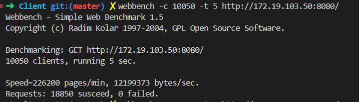

## C++ 实现轻量级服务器
基于 Linux 下实现 C++ 轻量级Web服务器 
* 基于**线程池** + **非阻塞Socket** + **Epoll** + **Reactor事件处理模式**实现的**半同步半反应堆的并发模型**
* 基于**单例模式**+**阻塞队列**，实现**Mysql数据库连接池**，实现**同步/异步日志系统**记录服务器运行状态 
* 基于**小根堆**的定时器断开长时间未活跃连接
* 支持部分**HTTP**、**WebSocket**请求协议解析
* 支持Web端请求服务器**图片、视频**等文件，Web端用户**注册、登录**功能
* 支持Web端用户在线群聊功能
 
`注：本项目学习来源markparticle作者编写的WebServer代码收获很多，另外本项目减少了大量的string，Buffer深拷贝，并在部分地方采用了线程池自动扩缩容优化、std::move等，目前在相同环境 Webbench 压测的QPS是原作者的两倍以上。`

### 项目演示图片

### [视频演示地址](https://www.youtube.com/watch?v=Xxt0DMNVPL4)

### TODO 

- [x] JWT 实现登录状态的判断
- [x] Web 端用户之间通信，基于 WebSocket
- [ ] 用户在线聊天并发测试
- [ ] 用户聊天记录保存
- [ ] 代码整理，Cmake 

### 参考资料：  
[1. markparticle WebServer](https://github.com/markparticle/WebServer)  
[2. TinyWebServer](https://github.com/qinguoyi/TinyWebServer)  
Linux高性能服务器编程，游双著.