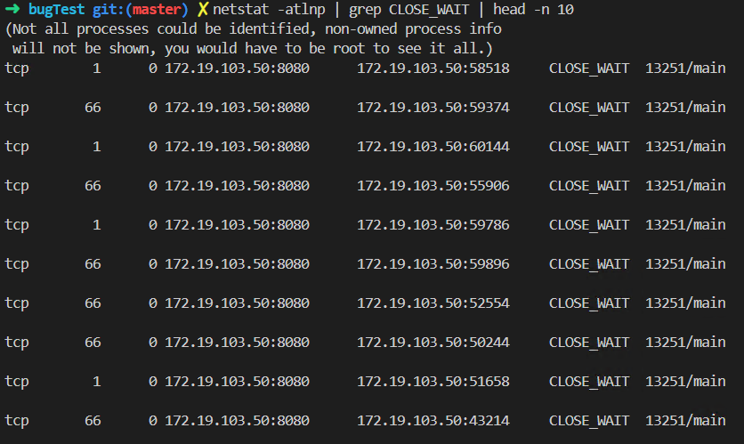
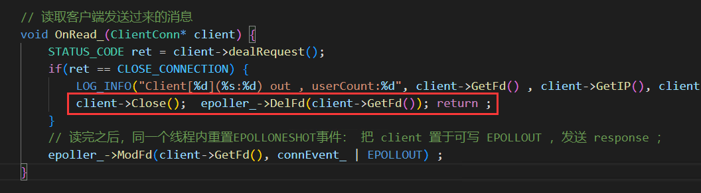
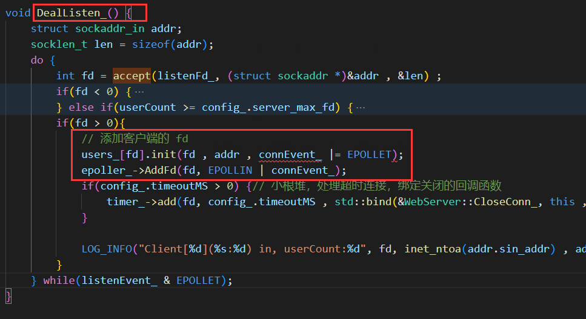

## 2023.4.14 修复服务端出现大量的 CLOSE_WAIT 情况
  
### 一、 初步日志排查  

问题刚开始出现来源于在进行 Webbench 做压力测试的时候，多进行了几次之后，服务端会自动退出，日志记录出现 `server accept Fail`，我的第一反应是文件描述符达到最大了，但是代码又用 `userCount`记录了快超过最大值的时候采用拒绝建立连接，故查看日志发现进程结束的时候最后的 `userCount` 居然高达 `3000+` , 于是第一思路转到应该是 `Close(fd)`没有得到及时执行。

### 二、深入分析

#### 1. 第一步：netstat 查看网络状态; Top 查看系统运行状态
不看不知道，一看直接麻了，服务端出现大量的 `CLOSE_WAIT` 状态连接，显然是服务端的错误，没有及时进行 `Close(fd)` 处理。`netstat -atlnp | grep 8080 `
  
但是为啥呀，我再查看系统运行情况 `top`，发现运行正常CPU和内存利用率都不高 , 再查看 `tcp`队列当前情况 , `Recv-Q = 0` 说明三次握手建立之后的连接都被处理了，`Send-Q = 6`是表明`ESTABLISHED` 队列设置的大小，也就是 `listen(backlog)` 的参数设置，我以为是这个设置小了的原因。后面查资料表明，当`ESTABLISHED` 队列满了时，服务端就不会从`SEND_RECV`队列中取连接加入到`ESTABLISHED`队列 , 其中`SEND_RECV`队列长度可以通过 `cat /proc/sys/net/ipv4/tcp_max_syn_backlog`命令查看,我系统下是 512，当`SEND_RECV`队列也满了的话，后面的连接就会被丢弃。但是显然与我这种情况没有关系，因为出现了 `CLOSE_WAIT` 是已经建立好了连接，但是服务端没有发送`FIN`断开连接的状态。所以就是逻辑代码没有断开连接，系统是正常运行的。
```
ss -lnt 
State      Recv-Q  Send-Q          
LISTEN      0       6
```


#### 2. 代码逻辑分析
通过上面的分析，包括对日志的再次检查，进一步确定了就是服务端没有执行`Close(fd)`，没有断开连接，故从 `read()` 返回 0 开始一行一行分析，最终确定在多线程没有做好`Close(fd) 和 epoll_del`原子性执行的原因，就是这两行代码，工作线程和主线程之间存在不同步。也就是说会有这样一种可能，工作线程刚`close(fd)`，主线程就 `accept` 新的一个`fd`并通过`epoller_add（）`，但是接着工作线程`epoller_del`就把刚才注册的删了，这样就会导致服务端一直没有处理客户端的请求。没错就是这样的。



### 三、问题解决
最终采取的解决方案，自然是保持`close(fd);epoller_del()`和`accept(fd);epoller_add（）`都是原子性按顺序执行，我交互了 `epoller_del(fd);close(fd);` 的顺序，这样主线程 `accept(fd)` 的时候之前的 fd 已经从 epller 中删除了，而 epoller 操作时保证线程安全的，并且 `accept()`相同文件描述符号时，也一定就是之前已经调用了 `close(fd)`。这样执行顺序就会是 ``epoller_del(fd); -> close(fd); -> accept(fd) -> epoller_add（fd）` 。`详细请看代码 code/Client/clientConn.h` 


